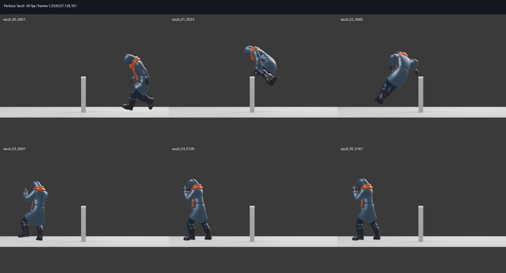

# Parkour Vault 围栏翻越素材评估

日期：2026-08-14

状态：源素材已复制；尚未合并运行模型，尚未接入玩家状态机。

## 产品决定

- 围栏翻越使用空格键，不占用 E 交互。
- `Parkour_Vault` 作为低矮围栏翻越的首选动作。
- “翻滚躲掩体”保留给后续闪避/掩体动作，不与围栏翻越混用；本次提供的 FBX 和下载目录中没有该动作的独立文件，需另行导出后才能入库。
- 只有前方命中明确标记的低矮障碍、顶部和落点都安全时才允许翻越；普通墙体、高障碍和未知碰撞体不得触发。

## 素材结论

- 原始文件：`Meshy_AI_Winter_Wanderer_biped_Animation_Parkour_Vault_frame_rate_60.fbx`
- 项目源文件：`assets/source/characters/animations/parkour_vault.fbx`
- 文件大小：`16,217,148` bytes
- SHA-256：`A663847F012429D1FB38DCEECD8D5DBDBC12C5D772EDA2DD4F4DEB4E51B20FCC`
- 实际内容：单个 `Parkour_Vault` take，不包含翻滚动作
- 动画长度：`2.6667 s`，60 fps，frame 1–161
- 骨架：与 Winter Wanderer 同名、同父级的 24 骨骨架，但 bind/rest pose 不是完全相同的一版
- 动作位移：Hips 约前进 `2.883 m`、侧移 `0.314 m`，垂直范围 `0.605 m`；它是带明显根位移的完整跑酷跨越，不是原地 one-shot

离线逐帧检查确认动作包含接近、收腿跨越、腾空和双脚落地，身体轮廓清楚，适合项目的低围栏；它比翻滚动作更符合“保持前进方向跨过栅栏”的意图。完整 2.67 秒中含接近和落地后的余量，运行时节奏须在真实碰撞和镜头下再定，不能只按文件总时长锁死玩家控制。

## 导入约束

不能把该 FBX 直接挂到当前 `AnimationTree`。Godot 直接导入 FBX 后的骨架使用米制空间，而现有 Blender→glTF 运行模型保留了不同的骨架单位和轴向；直接复制轨道会造成约 100 倍空间错位，让骨架与角色碰撞体分离。

也不能仅凭“骨名相同”就直接调用现有 `merge_animation()` 并宣称完成。离线绑定复现显示，新文件的 rest height 与当前源角色约为 `1.6215 m` 对 `1.6020 m`，Hips rest 也有差异；未经 rest-space bake 的落地帧会让双脚约埋入地面 `0.40 m`、Hips 末位比起始低约 `0.33 m`。因此必须先做全身 rest-space retarget/bake，并在目标角色上重新测量落地高度。

正确流程是：

1. 保留短名 `parkour_vault.fbx`，先把动作在 Blender 中从该文件的 rest space bake 到当前 Winter Wanderer 源骨架，并归一化落地高度；不能直接复制 fcurve。每骨每帧先求 donor 全局增量 `Ds = Gs_pose * Gs_rest^-1`，再以两套骨架的解剖基共轭到目标 `Dt = C * Ds * C^-1`，应用到目标 rest 后转回父级局部空间。
2. 扩展或配套 `tools/decimate_character.py`，把已校正的 take 与现有四个 animation-only FBX 一起重新生成 `assets/models/characters/winter_wanderer.glb`。
3. 在 `WandererAnimations.TAKES` 中把合并后的 `parkour_vault` 注册为非循环的 `vault`。
4. 在玩家 AnimationTree 中增加全身 one-shot，但水平位移必须由带碰撞检测的翻越状态驱动，不能让骨盆动画独自带走可见模型。
5. 翻越开始前检查障碍高度、厚度、顶部净空和落点胶囊空间；翻越中暂时接管常规移动，结束后恢复玩家控制。
6. 以 Space 作为独立输入；E 继续只负责门、拾取、炉子、信标和投喂。

运行时建议裁取源 frame `1–121`（`2.0 s`），按 `1.10×` 播放约 `1.82 s`；frame 121 已重新直立，之后约 `0.67 s` 主要是细微 settle。翻越检测先限定障碍高度 `0.75–1.20 m`，启动点约在障碍前 `1.30 m`、落点约在障碍后 `1.55 m`。当前栅栏雪顶约 `1.15 m`，需要按障碍顶面做约 `0.18–0.22 m` 的相位化垂直 target-fit；更高目标应拒绝或另走攀爬动作。

重建时必须保留当前已经合入 GLB 的动作，不能只传新文件。输入集合至少包括：

- `idle_neutral.fbx`
- `idle_cold_shiver.fbx`
- `knockdown_and_recover.fbx`
- `slow_orc_walk.fbx`
- `parkour_vault.fbx`

`assets/` 当前由仓库策略整体忽略，源 FBX 不产生也不需要 `.import` sidecar；普通 Git 提交不会携带该二进制。本报告记录文件名、哈希和接入约束，供本地素材包和后续重建复核。
